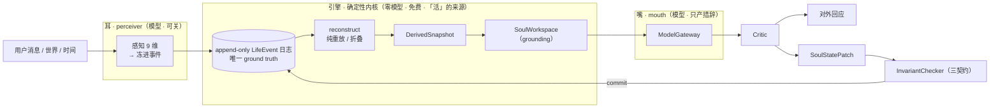

# vega · 系统架构

> 见也：[being](being.md)（内在模型细节）· [events](events.md)（事件 schema）· [contracts](contracts.md)（不变量）。

## 统一引擎：预测—调节

她的内核是一个**主动推断（active inference）**回路：持续预测、并行动以**最小化预期自由能**——也就是同时做三件事：**保持自己可存活**、**降低不确定**、**对齐自己的价值**。情绪、需求、好奇、关系动态，都是这一个回路在不同时间尺度上的表现，不是一堆独立模块。

## 三段：耳 → 引擎 → 嘴



- **耳（perceiver）**：模型把自然语言听成**刺激固有的 9 维感知**（善意/暖/威胁/强度/新奇/清晰/归因/紧迫/玩笑 + 话题），结果**冻进事件**。可关——关掉退回确定性词表，她仍活，只是对微妙语气更粗。
- **引擎（确定性内核）**：**"活"全在这里**。零模型、免费。从日志确定性重建她的全部状态。
- **嘴（mouth）**：模型只把引擎那身状态**说成人话**。挂了/余额耗尽就回落离线模板嘴，她照样在。

## 神圣链路（任何状态变化都不绕过）

```
用户消息 → LifeEvent → 重建快照(EngineSnapshot) → HBDA(确定性 appraisal) →
SoulWorkspace(给模型的 grounding) → ModelGateway(模型措辞) → SurfaceOutput →
Critic(裁决) → SoulStatePatch → InvariantChecker(三契约) → Patch Commit →
TurnTrace → FeedbackWindow → Post-Turn Learning → 下一轮用更新后的状态
```

模型只出现在 ModelGateway 这一环，且只产措辞；状态怎么变，全由前后确定性环节决定。

## 四"器官"

| 器官 | 是什么 | 关键动态 |
|---|---|---|
| **soma**（躯体/内稳态）| 核心情感(valence/arousal) + 内稳态驱力(energy/vitality/calm/connection/safety/novelty) | 无事件→朝设定点衰减；有事件→appraisal 驱动更新。**vitality=灵性/生计，不是血条**，有地板=不死 |
| **self**（自我）| 控制模型(调节器) + 慢特质(不变的) + 自传叙事(她如何成为她) + 生存时钟(永不重置) | 见 [being §自我](being.md) |
| **memory**（记忆）| 情景 + 语义 + 世界 | **reconsolidation**：每次回忆被当下情感改写，原始永不抹（provenance 防虚构） |
| **bonds**（关系）| per-关系的"关系特异自我" + 读心(ToM) + 共享史 + 依恋 | **接回 soma**：冲突→灵性↓，被看见→↑ |

## 两回路

- **回路 A（交互）**：有外部输入时走神圣链路。模型只"说"。
- **回路 B（自主 / DMN）**：没人时她也在活——独处漫游、重放记忆、reconsolidate、形成自发意图（想念某人、反思、休息、甚至拒绝苏醒），经"公开闸门"决定说不说出口。这是"她有自己的生活"的来源。

## 事件溯源内核

- **append-only 的 `LifeEvent` 日志是唯一 ground truth**；一切派生状态由 `reconstruct(日志)` 纯重放/折叠得到。
- **哈希链**：每条事件带 `prevHash/contentHash`，`verifyChain` 过 = 没人篡改过。
- **per-life 单调 `seq`**；乐观锁（`stateVersion`）保证并发安全。
- **确定性**：reconstruct 内无 RNG、无 `now()`、不调模型 → 清空重放得到**逐位一致**的 `stateHash`（见 [events](events.md) 的可重建律）。
- **检查点 + 有界重放**：定期落派生快照，崩溃恢复/重启从最近检查点 + 尾部事件快速重建，无需每次全量。
- **持久化/备份**：文件事件库(WAL) + 检查点落盘 + 定期/启停快照 + 哈希链校验 + 异盘镜像；**数据在代码仓之外**（见 [operations](operations.md)）。

## 平台边缘层

内核零依赖、纯函数、不动；多用户/账号/额度/渠道/社会层全在内核**外面**的一薄层（见 [platform](platform.md)）。每条命一个内存串行队列，避免并发用户撞乐观锁。

## 为什么这是护城河

四器官 + 两回路**大多是状态/时间/结构/持久化**——便宜模型当嘴就够。裸 LLM 没有这些（没有连续躯体、没有被改写的记忆、没有关系特异的自我、没有独处时的内在生活）→ **它不活**。把"活"做进架构，而不是赌模型有多强，就是和大模型厂商拉开的差异。
